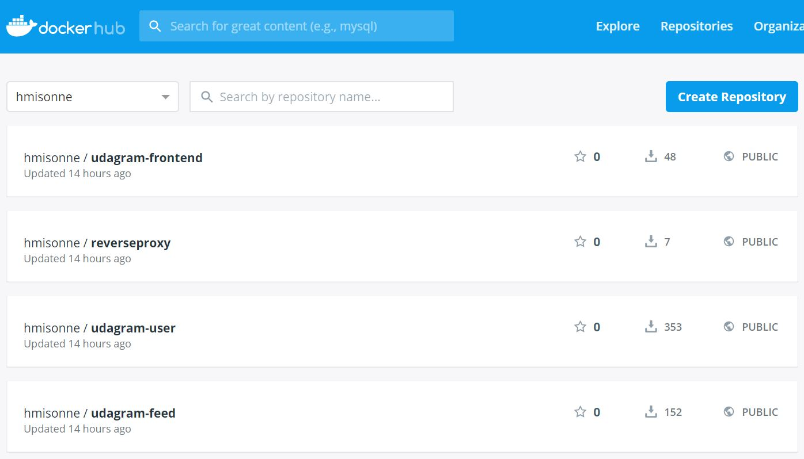
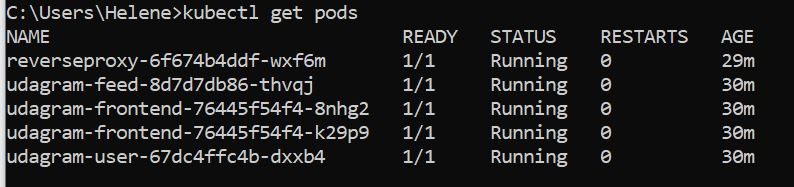
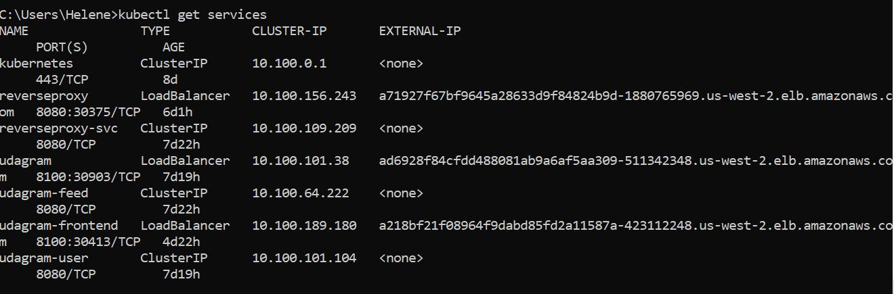

# Refactor Monolith to Microservices

## Udagram Image Filtering Application

Udagram is a simple cloud application developed alongside the Udacity Cloud Engineering Nanodegree. It allows users to register and log into a web client, post photos to the feed, and process photos using an image filtering microservice.

The project is split into two parts:
1. Frontend - Angular web application built with Ionic Framework
2. Backend RESTful API - Node-Express application

## Key Achievements: 

1. Refactor the API: Decompose the API code to have two separate projects that can be run independent of one another: /users and /feed endpoints.

2. Containerize the Code: Create Dockerfiles for the frontend and backend applications.



3. Build CICD Pipeline: Set up GitHub account to integrate with Travis CI and generate a build pipeline.


4. Deploy to Kubernetes: Deploy the Docker containers for the API applications and web application as their own pods in AWS EKS.



5. Set up Kubernetes Services: Configure a reverse proxy to direct requests to the appropriate backend and frontend loadbalancer




## Getting Started

### Prerequisite
1. The depends on the Node Package Manager (NPM). You will need to download and install Node from [https://nodejs.com/en/download](https://nodejs.org/en/download/). This will allow you to be able to run `npm` commands.

### Database & Filestore
For this project, a Postgres database and S3 bucket were previously set up from AWS that are no longer running. If you wish to use your own database, filestore, update the config parameters on src/config/config.ts file

### Backend API
* To download all the package dependencies, run the command from the directories `udagram-api-user/` and `udagram-api-feed/`:
    ```bash
    npm install .
    ```
* To run the application locally, run:
    ```bash
    npm run dev
    ```
* You can visit `http://localhost:8080/api/v0/feed` in your web browser to verify that the application is running. You should see a JSON payload. 

### Frontend App
* To download all the package dependencies, run the command from the directory `udagram-frontend/`:
    ```bash
    npm install .
    ```
* Install Ionic Framework's Command Line tools for us to build and run the application:
    ```bash
    npm install -g ionic
    ```
* Prepare your application by compiling them into static files.
    ```bash
    ionic build
    ```
* Run the application locally using files created from the `ionic build` command.
    ```bash
    ionic serve
    ```
* You can visit `http://localhost:8100` in your web browser to verify that the application is running. You should see a web interface.

